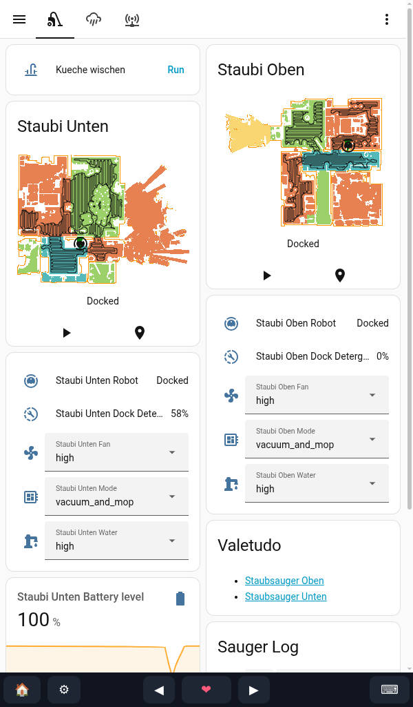

# Dashboard Assistant

**A declarative, unbreakable Home Assistant Kiosk OS built on NixOS.** Flash it to
a mini-PC or tablet, point it at your Home Assistant, and get a self-contained
wall dashboard that integrates *back* into HA through a native custom integration
(installable via HACS) — so the screen itself becomes something you can see and
control from your automations.

  
  
  
  
  
  

> [!WARNING]
> This is in early development. Expect lots of changes.
> Not recommended for daily use as of now.

> [!IMPORTANT]
> This is not affiliated to the Open Home Foundation or Home Assistant.
> This is my personal project.

---

- [Dashboard Assistant](#dashboard-assistant)
  - [Why](#why)
  - [Features](#features)
  - [Roadmap/Todos/Thoughts](#roadmaptodosthoughts)
  - [Credits](#credits)
  - [License](#license)
  - [Author](#author)

## Why

I was annoyed how much setup you needed in order to get a good dashboard experience.
Install some Linux Distribution, add packages, do this and that, configure things.
The motivation was born to make this easier, with no Linux knowledge needed.

- **Flash and go.** No Linux knowledge needed. Write one image, boot it, scan a
  QR code to put it on your Wi-Fi, and it pairs with Home Assistant and logs
  itself in.
- **Over-the-air updates.** Update the whole OS from Home Assistant.
- **Unbreakable.** It's NixOS. A bad update never bricks the wall panel — the
  device keeps every previous generation, and its LAN-only admin page lets you
  roll back to a known-good one from any machine on your network.
- **Two-way Home Assistant integration.** Most kiosks *show* HA. This one also
  *appears in* HA: the display, brightness, zoom, theme, power, current page and
  device health are all entities you can automate, via a native integration
  (installable through HACS) — no MQTT broker needed. Turn off your display after
  some time and turn it on when motion has been detected.

## Features

Full-screen Chromium locked to your dashboard, multiple cyclable URLs, touch
wake, an on-screen keyboard, token auto-login, rollback to any previous
generation, atomic OTA updates, multi-room audio, and seed-file provisioning —
all controllable from Home Assistant, which discovers the device over mDNS via
the native integration (installable through HACS).

See the [**Features**](https://dashboardassistant.org/about/features/)
page for the full list and the complete Home Assistant entity reference
(controls + sensors).

## Roadmap/Todos/Thoughts

- [x] Raspberry Pi 4 and 5 support with the official touchscreen
- [ ] Testing Raspberry Pi 3 support
- [ ] Possibly more SBC boards
- [ ] Possibly Microsoft Surface Tablets
- [x] Fix touch keyboard
- [ ] Remove boot selection for generations on startup
- [ ] Make the installation smaller
- [ ] Track a NixOS Channel instead of unstable
- [ ] Check if the provision file can always be used instead only on first boot
- [ ] Adjust layout for menus, static nav bar on top
- [ ] Removing menu items, like pages
- [x] Add flashable images somewhere
- [ ] Create a logo
- [x] Add website + documentation
- [ ] Add live logs in config and allow copy paste
- [ ] Think bout allowing configuring the dashboard over the network
- [ ] Think about encryption

## Credits

Inspired by [TouchKio](https://github.com/leukipp/touchkio).

## License

Not yet licensed. Until a `LICENSE` file is added, all rights are reserved.

## Author

This project was created by Andrej Friesen in 2026.

