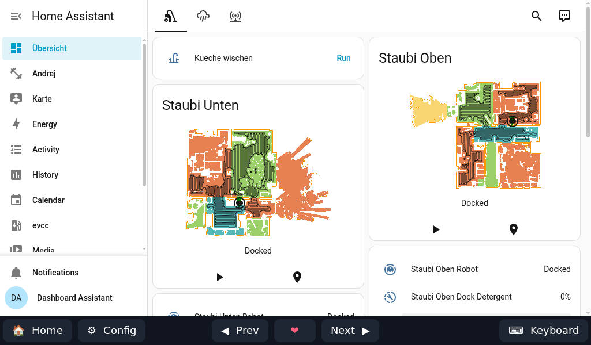
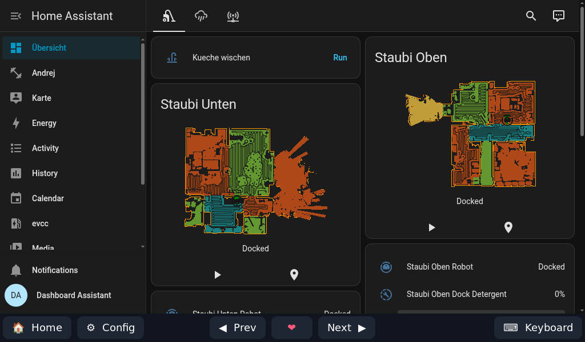
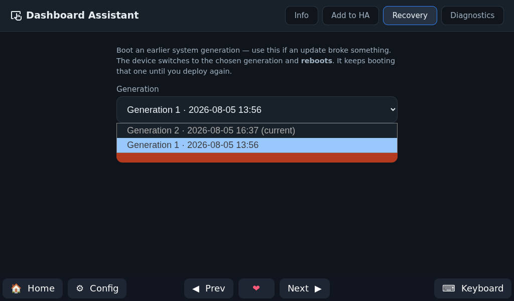
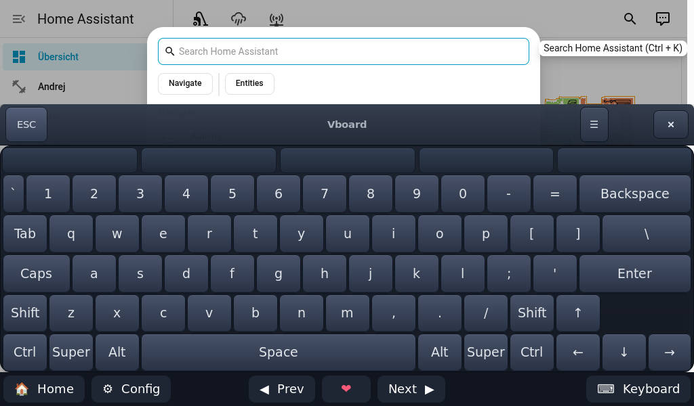
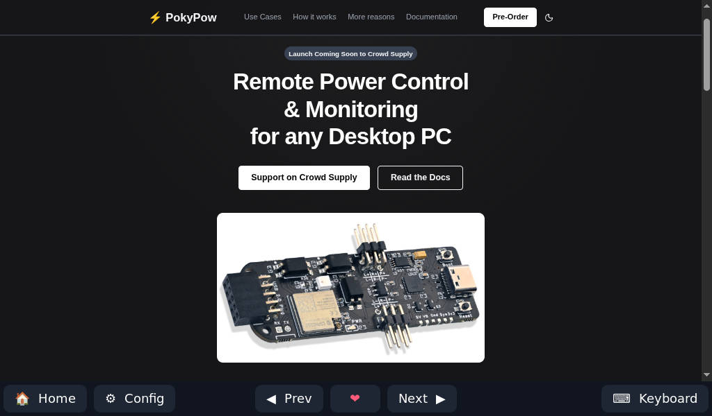

<section class="da-hero" markdown>

Home Assistant on your wall

# Your Home Assistant Dashboard, wherever you like {: .da-hero__title }

Download one image, flash it to an SD card or SSD, and power on your device. It
wakes up as a Home Assistant dashboard on your wall or desk. No Linux knowledge, no terminal, no weekend of tinkering. Just your smart home, on the wall.

[Get started&nbsp;→](flash/flash.md){ .da-btn .da-btn--primary }
[See it in action](in-action.md){ .da-btn .da-btn--ghost }

<!--
  Tablet mockup. The screen crossfades through the  slides below — swap
  these for your own screenshots any time. The crossfade is tuned for THREE
  slides; if you add/remove images, update `--da-slides` and the `:nth-child`
  delays in docs/stylesheets/extra.css.
-->

  

    
    
    
    
    
  

</section>

## Everything you need for a wall dashboard {: .da-section-title }

Made for a screen on the wall — not a computer to look after.

⚡

### Download, flash, boot
Write one image to an SD card or SSD, pop it into your tablet, mini-PC or
Raspberry Pi, and power on. No Linux knowledge, no complicated setup.

🔑

### Signs itself in
It logs in to Home Assistant for you and boots straight to your dashboard — no
login screen to tap through every time.

🏠

### Part of Home Assistant
The screen shows up in Home Assistant like any other device. Turn it on or off,
dim it, or have your automations do it for you.

🌐

### Show any page
Add as many dashboards or websites as you like and flip between them — from Home
Assistant or a tap on the screen.

👆

### Made for touch
Tap to wake the screen and type with the on-screen keyboard. No mouse or
keyboard to plug in.

🔄

### Updates from Home Assistant
When a new version is ready, install it from Home Assistant with one tap. No
terminal, nothing to re-flash.

🛟

### Easy to undo
If an update ever misbehaves, go back to a version that worked with a couple of
taps on the screen.

[Get started&nbsp;→](flash/flash.md){ .da-btn .da-btn--primary }
[Stack for Nerds](stack-for-nerds.md){ .da-btn .da-btn--ghost }

Want to know what's running under the hood? It's all in
<a href="stack-for-nerds/">Stack for Nerds</a>.

